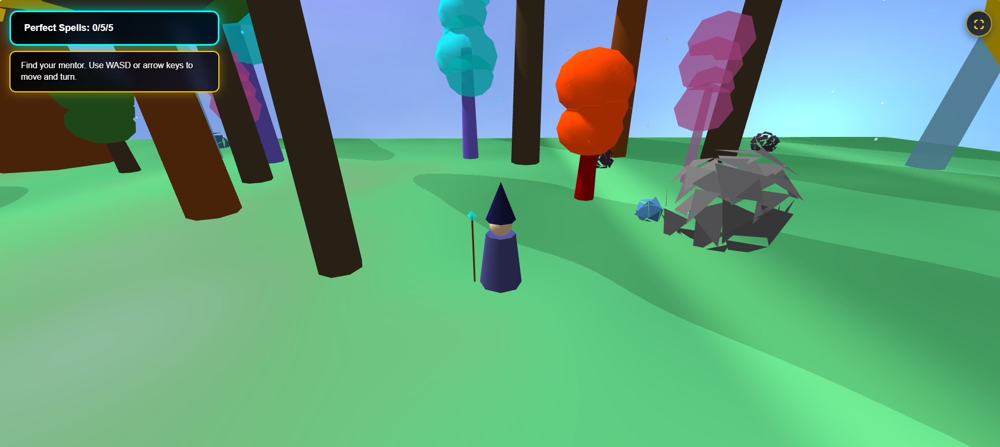
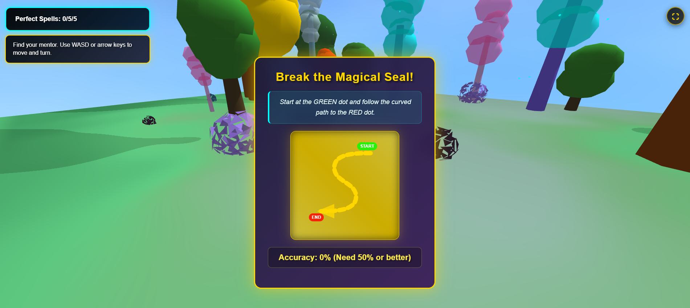
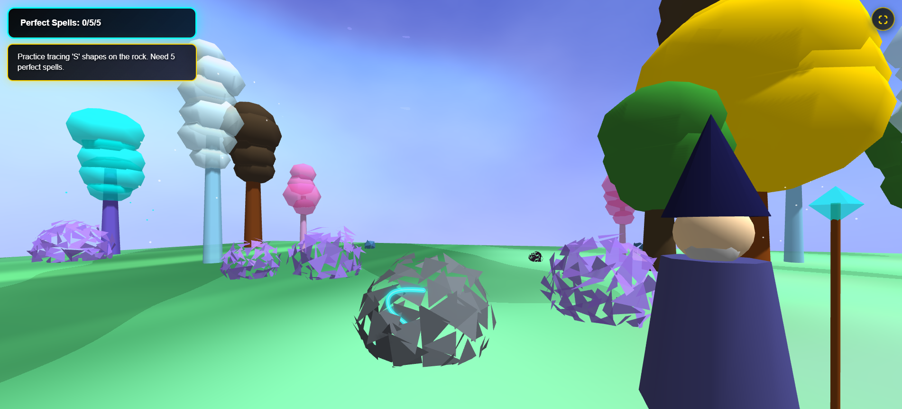
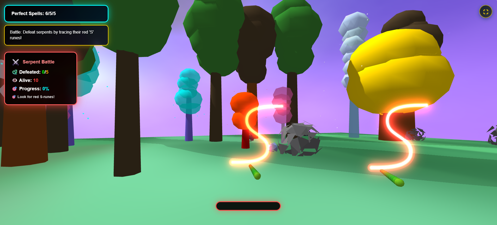
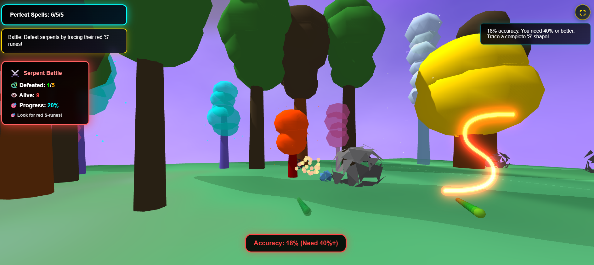

# Wizard Adventure Game - Master the 'S' Shape
## 🎮 Cross-Platform Educational 3D Web Game with Full Mobile Support

DEMO: thewizardgame.netlify.app 







## 📖 Overview

Wizard Adventure is a cutting-edge educational 3D web game specifically designed to help children with dyslexia learn proper letter formation, focusing on the challenging letter 'S'. Players embark on a magical journey as a wizard's apprentice who must master the ancient 'S' spell to save their mentor and defend against mystical serpents.

**Now featuring complete mobile and tablet compatibility** with touch controls, virtual joystick, and responsive design - providing an excellent educational gaming experience across all devices while maintaining the original desktop functionality.

The game provides a progressive learning experience across three distinct phases, each reinforcing the same S-shape tracing mechanics with increasing complexity, immersive camera perspectives, and a complete audio experience featuring background music, sound effects, and voice dialogue.

## ✨ Key Features

### 📱 **NEW: Universal Device Support**
- **Mobile & Tablet Ready**: Full compatibility with phones and tablets
- **Virtual Joystick Controls**: Nipple.js-powered 360° movement control
- **Touch Drawing System**: Enhanced touch support for S-shape tracing
- **Fullscreen Experience**: Immersive fullscreen mode on all devices
- **Adaptive UI**: Responsive design that scales perfectly across screen sizes
- **Performance Optimized**: Efficient rendering for mobile hardware

### 🎯 Educational Core
- **Dyslexia-Focused Design**: Evidence-based learning for letter 'S' formation
- **Progressive Difficulty**: Scaffolded learning from guided (50%) → practice (40%) → application (40%)
- **Consistent S-Shape Template**: Same sacred rune pattern across all three phases
- **Real-Time Feedback**: Immediate accuracy measurement and visual guidance
- **Multi-Sensory Learning**: Visual, motor, and auditory feedback integration

### 🎥 Revolutionary Camera System
- **Dual-Mode Operation**: Seamless switching between third-person and first-person views
- **Phase-Specific Perspectives**: 
  - Third-person for exploration and spatial awareness
  - First-person for focused learning and intense combat
- **Perfect Synchronization**: Zero-lag camera movement with automatic character visibility control
- **Smooth Transitions**: 1-second camera mode transitions with easing functions

### 🎵 Complete Audio Integration
- **Dynamic Background Music**: Scene-specific tracks with smooth transitions
- **Interactive Sound Effects**: 6 distinct FX triggered by player actions
- **Voice Dialogue System**: 9 narrative audio clips for story progression
- **Volume-Balanced Design**: Optimized levels for music (40%), FX (24%), and dialogue (90%)

### 🎮 Advanced Gameplay Systems
- **Enhanced Drawing Recognition**: Dual-metric accuracy system with template matching
- **Immersive Battle System**: First-person combat against 5 serpents with smart targeting
- **Massive Training Environment**: 4x larger interactive elements for better visibility
- **Magical World Design**: Ultra-magical sky with integrated mountain ranges and 75k+ grass blades

### 🛠️ Technical Excellence
- **Modular ES6 Architecture**: 20+ specialized component files
- **Cross-Platform Optimized**: Desktop, laptop, tablet, and mobile support
- **Browser Compliant**: Modern web standards with WebGL support
- **Professional Presentation**: Clean, distraction-free educational interface

## 🗂️ Project Architecture

### Core Structure
```
wizard-adventure-game/
├── index.html                 # Main entry point with mobile viewport
├── music.js                   # Background music system
├── fx.js                      # Sound effects system  
├── dialogue.js                # Voice dialogue system
├── readme.md                  # This comprehensive guide
│
├── css/                       # Stylesheets
│   ├── main.css              # Core UI with battle enhancements
│   ├── popups.css            # Educational popups with repositioned labels
│   ├── animation.css         # Visual effects and celebrations
│   ├── responsive.css        # Enhanced responsive design with mobile breakpoints
│   └── mobile.css            # ✨ NEW: Mobile-specific styles and touch UI
│
├── js/                        # JavaScript modules (ES6)
│   ├── main.js               # Game orchestrator with mobile integration
│   ├── GameManager.js        # Three.js setup and rendering
│   ├── Character.js          # Player mesh and controller integration
│   ├── CharacterController.js # Phase-specific movement system
│   ├── cameraSystem.js       # Revolutionary dual-camera system
│   ├── Scenes.js             # Scene management and world state
│   ├── draw.js               # Advanced drawing system with touch support
│   ├── dialogueSystem.js     # Educational feedback and guidance
│   ├── Snakes.js             # Enhanced serpent battle system
│   ├── rock.js               # Massive 4x scaled training rock
│   ├── Wizard.js             # NPC mentor with AI following
│   ├── Cage.js               # Enhanced magical prison
│   ├── magic.js              # Particle effects for spell casting
│   ├── Sky.js                # Ultra-magical sky with mountains
│   ├── Ground.js             # Magical terrain with 75k grass system
│   ├── TreesRocks.js         # Magical forest environment
│   ├── text.js               # Score and UI text management
│   └── MobileControls.js     # ✨ NEW: Complete mobile control system
│
├── audio/                     # Audio assets (create these folders)
│   ├── music/                # Background music tracks
│   │   ├── scene1.mp3        # Exploration/cage unlock music
│   │   ├── scene2.mp3        # Training phase music
│   │   └── scene3.mp3        # Battle phase music
│   │
│   ├── fx/                   # Sound effects
│   │   ├── cage.mp3          # Cage encounter sound
│   │   ├── popup.mp3         # UI popup/notification sound
│   │   ├── s.mp3             # S-shape drawing sound
│   │   ├── sleep.mp3         # Snake defeat/sleep sound
│   │   ├── spell.mp3         # Successful spell casting sound
│   │   └── success.mp3       # Scene completion sound
│   │
│   └── dialogue/             # Voice dialogue files
│       ├── 1_hello.mp3       # Scene 1 welcome
│       ├── 2_howto.mp3       # Cage unlock instructions
│       ├── 3_tryagain.mp3    # Cage unlock failure
│       ├── 4_complete.mp3    # Cage unlock success
│       ├── 5_scene2.mp3      # Training phase start
│       ├── 6_scene3.mp3      # Battle phase start
│       ├── 7_scene3bad.mp3   # Battle miss feedback
│       ├── 8_scene3good.mp3  # Battle hit feedback
│       └── 9_victory.mp3     # Victory celebration
```

## 🚀 Quick Start

### Prerequisites
- Modern web browser with WebGL support (Chrome, Firefox, Safari, Edge)
- Local web server (recommended: VS Code Live Server extension)
- Audio files in the specified format and locations

### Installation
1. **Clone the repository:**
   ```bash
   git clone https://github.com/yourusername/wizard-adventure-game.git
   cd wizard-adventure-game
   ```

2. **Set up audio assets:**
   ```bash
   mkdir -p audio/music audio/fx audio/dialogue
   # Add your .mp3 files to the respective folders
   ```

3. **Launch with local server:**
   ```bash
   # Using Python
   python -m http.server 8000
   
   # Using Node.js
   npx http-server
   
   # Using VS Code Live Server extension (recommended)
   # Right-click index.html → Open with Live Server
   ```

4. **Open in browser:**
   ```
   http://localhost:8000
   ```

### 📱 Mobile Setup
The game automatically detects your device and provides appropriate controls:
- **Mobile/Tablet**: Virtual joystick + touch drawing
- **Desktop**: Keyboard controls + mouse drawing
- **All Devices**: Fullscreen button in top-right corner

### Dependencies
The game uses these CDN resources (automatically loaded):
```html
<!-- Three.js for 3D graphics -->
<script src="https://cdnjs.cloudflare.com/ajax/libs/three.js/r128/three.min.js"></script>

<!-- Nipple.js for mobile joystick controls -->
<script src="https://cdnjs.cloudflare.com/ajax/libs/nipplejs/0.10.1/nipplejs.min.js"></script>
```

## 🎮 Gameplay Guide

### 🖥️ Desktop Controls
- **Movement**: WASD keys or Arrow keys
- **Drawing**: Click and drag mouse to trace S-shapes
- **Camera**: Automatic phase-specific perspective switching
- **Fullscreen**: Click fullscreen button (top-right)

### 📱 Mobile/Tablet Controls
- **Movement**: Virtual joystick (bottom-left corner)
- **Drawing**: Touch and drag finger to trace S-shapes
- **Camera**: Same automatic perspective system
- **Fullscreen**: Touch fullscreen button (top-right)

### Game Phases

#### Phase 1: Exploration & Cage Unlock
- **Camera**: Third-person follow for spatial awareness
- **Objective**: Find mentor and break magical seal
- **Challenge**: Trace golden S-rune (50%+ accuracy required)
- **Audio**: Exploration music, cage discovery FX, tutorial dialogue

#### Phase 2: Spell Training (Enhanced)
- **Camera**: Immersive first-person for focused learning
- **Environment**: 4x larger training rock with massive glowing S-rune
- **Objective**: Master 5 perfect spells (40%+ accuracy each)
- **Features**: Character invisible for true first-person perspective
- **Audio**: Training music, spell casting FX, progress dialogue

#### Phase 3: Serpent Battle (Enhanced First-Person Combat)
- **Camera**: Intense first-person battle perspective
- **Challenge**: Defeat all 5 serpents with S-shape spells
- **Mechanics**: Red S-runes above serpents, smart targeting system
- **Victory**: Score 5/5 for perfect victory
- **Audio**: Battle music, combat FX, dynamic battle dialogue

## 📱 Mobile Features

### 🕹️ Virtual Joystick System
- **Position**: Bottom-left corner of screen
- **Functionality**: 360-degree movement control
- **Visual Design**: Golden border with backdrop blur
- **Responsive Size**: Adapts to screen size and orientation
- **Auto-Hide**: Only visible on mobile/tablet devices

### 🖱️ Enhanced Touch Drawing
- **Larger Tolerance**: Generous touch areas for easier tracing
- **Visual Feedback**: Thicker drawing lines on mobile
- **Proximity Detection**: More lenient targeting for touch inputs
- **Accuracy Display**: Repositioned to avoid joystick overlap

### 📱 Fullscreen Experience
- **Universal Button**: Works on all devices and browsers
- **Visual Indicator**: Icon changes based on fullscreen state
- **Position**: Top-right corner, clear of other UI elements
- **Browser Support**: Compatible with all major mobile browsers

### 🔄 Orientation Support
- **Auto-Detection**: Responds to device orientation changes
- **Layout Adjustment**: UI repositions for landscape/portrait
- **Recommendation**: Landscape mode for optimal gameplay
- **Performance**: Optimized layouts for different orientations

## 🛠️ Technical Implementation

### Mobile Device Detection
```javascript
// Automatic device type detection
const deviceTypes = {
    mobile: screen.width <= 768 && /Mobile|Android|iPhone/i.test(navigator.userAgent),
    tablet: screen.width >= 768 && screen.width <= 1024 && 'ontouchstart' in window,
    desktop: screen.width > 1024 && !('ontouchstart' in window)
};
```

### Responsive Breakpoints
- **Mobile Phones**: ≤ 480px (Compact joystick: 120px)
- **Large Phones**: 481px - 767px (Medium joystick: 140px)
- **Tablets**: 768px - 1024px (Large joystick: 180px)
- **Desktop**: > 1024px (No joystick, keyboard controls)

### Audio Systems Architecture

#### Music System (`music.js`)
```javascript
class MusicSystem {
    // Features:
    // - Automatic scene detection and music switching
    // - Smooth fade transitions between tracks
    // - Browser autoplay policy compliance
    // - Volume control (40% default)
    // - Loop functionality for continuous ambiance
}
```

#### FX System (`fx.js`)
```javascript
class FXSystem {
    // Features:
    // - Event-driven sound triggering
    // - Action-based audio feedback
    // - Debouncing for spam prevention
    // - Volume control (24% default)
    // - Smart popup/UI sound detection
}
```

#### Mobile Controls System (`MobileControls.js`)
```javascript
class MobileControls {
    // Features:
    // - Device detection (phone/tablet/desktop)
    // - Nipple.js joystick integration
    // - Fullscreen API implementation
    // - Touch event handling
    // - Orientation change management
    // - Mobile UI adjustments
}
```

### Drawing Recognition System
- **Dual-Metric Accuracy**: Combines drawing precision with template coverage
- **Touch Support**: Enhanced touch event handling for mobile devices
- **Real-Time Feedback**: Colored drawing trails based on accuracy
- **Template Matching**: Precise S-shape path comparison
- **Smart Targeting**: Automatic serpent targeting in first-person combat
- **Consistent Templates**: Same S-shape across all phases

## 🎯 Educational Design Principles

### Evidence-Based Learning
- **Multi-Sensory Approach**: Visual, motor, and auditory feedback integration
- **Repetitive Practice**: Same S-shape across multiple engaging contexts
- **Immediate Feedback**: Real-time accuracy measurement with encouraging audio
- **Positive Reinforcement**: Celebration of progress and effort with music/FX
- **Scaffolded Learning**: Progressive difficulty with consistent visual patterns

### Universal Accessibility
- **Cross-Platform Access**: Works on any device with a web browser
- **Touch-Friendly**: Large touch targets and generous interaction areas
- **High Contrast Colors**: Clear visual feedback for all learners
- **Audio Descriptions**: Voice guidance for every major action
- **Adjustable Difficulty**: Multiple accuracy thresholds for different skill levels
- **Distraction-Free Design**: Clean interface focusing on educational objectives

## 🌐 Browser & Device Compatibility

### Supported Browsers
#### Desktop
- **Chrome 90+** (Excellent performance)
- **Firefox 88+** (Full feature support)
- **Safari 14+** (Good compatibility)
- **Edge 90+** (Excellent performance)

#### Mobile
- **iOS Safari 12.0+** (Full mobile support)
- **Chrome Mobile 70.0+** (Excellent performance)
- **Firefox Mobile 68.0+** (Good compatibility)
- **Samsung Internet 10.0+** (Full support)
- **Edge Mobile 44.0+** (Good compatibility)

### Device Support
#### Recommended Mobile Devices
- **iPhones**: iPhone 7+ recommended
- **Android Phones**: 4GB RAM+ recommended
- **iPads**: All models supported
- **Android Tablets**: 3GB RAM+ recommended

#### Performance Requirements
- **Minimum**: 2GB RAM, 1.5GHz processor
- **Recommended**: 4GB RAM, 2.0GHz processor
- **Optimal**: 6GB+ RAM, modern chipset

### Technical Requirements
- **WebGL Support**: For 3D graphics rendering
- **ES6 Module Support**: For modular JavaScript architecture
- **Web Audio API**: For comprehensive audio system functionality
- **Touch Events**: For mobile interaction (mobile devices only)
- **Fullscreen API**: For immersive experience

## 🔧 Development & Testing

### Mobile Testing Checklist
#### ✅ Mobile Phone Testing
- [ ] Virtual joystick appears and functions correctly
- [ ] Touch drawing works with appropriate accuracy tolerance
- [ ] Fullscreen button toggles properly
- [ ] UI elements don't overlap in portrait/landscape
- [ ] Performance maintains 30+ FPS
- [ ] All three game phases work correctly
- [ ] Help system shows mobile-appropriate controls

#### ✅ Tablet Testing
- [ ] Larger joystick appears appropriately sized
- [ ] Touch accuracy is precise and responsive
- [ ] UI scaling looks professional
- [ ] Both orientations work seamlessly
- [ ] Fullscreen experience is immersive
- [ ] Audio system functions properly

#### ✅ Desktop Testing (Regression)
- [ ] Virtual joystick is hidden on desktop
- [ ] Keyboard controls (WASD/arrows) still work
- [ ] Mouse drawing remains unchanged
- [ ] No mobile UI elements are visible
- [ ] Performance is not negatively impacted

#### ✅ Cross-Browser Testing
- [ ] Chrome Mobile - All features functional
- [ ] Safari iOS - Touch and fullscreen work
- [ ] Firefox Mobile - Joystick operates correctly
- [ ] Samsung Internet - Complete compatibility
- [ ] Edge Mobile - Full functionality

### Performance Optimizations
#### Mobile-Specific Optimizations
- **Reduced Blur Effects**: Lower backdrop-filter values for better performance
- **Simplified Animations**: Shorter durations and fewer complex effects
- **Touch Debouncing**: Prevents accidental multiple touch registrations
- **Memory Management**: Efficient cleanup of mobile-specific resources
- **Frame Rate Monitoring**: Automatic quality adjustment based on device performance

#### Battery Saving Features
- **Reduced Motion Support**: Honors user accessibility preferences
- **Efficient Drawing**: Optimized touch path calculations
- **Smart Rendering**: Reduced visual effects on slower devices
- **Intelligent LOD**: Level-of-detail management for 3D objects

### Development Setup
1. **Fork the repository**
2. **Create feature branch**: `git checkout -b feature/amazing-feature`
3. **Install development tools**: Live Server, code formatter
4. **Follow coding standards**: ES6 modules, consistent naming, clear comments
5. **Test thoroughly**: Verify mobile controls, audio systems, camera transitions
6. **Test on real devices**: Use actual mobile devices for touch testing
7. **Submit pull request**: Include detailed description and testing notes

## 🚀 Performance Metrics

### Target Specifications
#### Desktop
- **Frame Rate**: Consistent 60fps on modern hardware
- **Load Time**: <5 seconds for complete initialization
- **Memory Usage**: <400MB RAM for optimal performance

#### Mobile
- **Frame Rate**: Consistent 30fps on recommended devices
- **Load Time**: <8 seconds for complete initialization
- **Memory Usage**: <300MB RAM on mobile devices
- **Battery Usage**: Optimized for extended play sessions

### Audio Performance
- **Audio Latency**: <100ms response time for interactive sounds
- **Touch Response**: <50ms for drawing and joystick input
- **Scene Transitions**: <2 seconds for smooth phase changes

## 🔮 Future Enhancement Roadmap

### Mobile Enhancements
- **Haptic Feedback**: Vibration feedback for spell casting success
- **Gyroscope Controls**: Optional tilt-based movement controls
- **Voice Recognition**: Speech-to-text for alternative interaction
- **Offline Mode**: Progressive Web App with offline capabilities

### Educational Expansions
- **Additional Letters**: Extend to B, D, P, Q with similar immersive experiences
- **Adaptive Difficulty**: AI-powered accuracy adjustment based on student performance
- **Progress Analytics**: Long-term learning tracking and reporting systems
- **Multilingual Support**: Internationalization for global educational use

### Technical Improvements
- **WebXR Integration**: Virtual and Augmented Reality support
- **Advanced Audio**: 3D spatial audio for enhanced immersion
- **Cloud Saves**: Progress synchronization across devices
- **Teacher Dashboard**: Classroom management and progress monitoring tools

### Social Features
- **Multiplayer Mode**: Collaborative learning experiences in shared 3D environments
- **Parent Portal**: Progress sharing and home practice extensions
- **Achievement System**: Comprehensive progress badges and certificates
- **Mini-Games**: Additional S-shape challenges and practice modes

## 👥 Contributing

We welcome contributions that enhance the educational value and technical quality of the Wizard Adventure Game. Whether you're improving mobile performance, adding accessibility features, or expanding educational content, your contributions help children learn more effectively.

### Code Style Guidelines
- **ES6 Modules**: Use import/export for all components
- **Mobile-First**: Consider mobile experience in all new features
- **Consistent Naming**: camelCase for variables, PascalCase for classes
- **Clear Comments**: Document complex algorithms and mobile-specific logic
- **Error Handling**: Graceful fallbacks for audio failures and touch limitations
- **Performance Focus**: Optimize for both desktop and mobile target hardware

### Contribution Areas
- **Educational Content**: Additional letters, learning assessments
- **Accessibility**: Enhanced support for diverse learning needs
- **Mobile Experience**: Touch gesture improvements, performance optimizations
- **Audio Systems**: Additional sound effects, music tracks
- **Internationalization**: Multi-language support
- **Testing**: Automated testing for mobile and desktop platforms

## 📄 License & Credits

### License
This project is licensed under the MIT License - see the [LICENSE](LICENSE) file for details.

### Educational Research Basis
- **Multi-Sensory Learning Theory**: Visual, auditory, and kinesthetic integration
- **Dyslexia Research**: Evidence-based practices for letter formation
- **Game-Based Learning**: Engagement through progressive achievement
- **Universal Design**: Accessible learning across all devices and abilities

### Technology Credits
- **Three.js**: 3D graphics rendering engine
- **Nipple.js**: Virtual joystick for mobile controls
- **Web Audio API**: Comprehensive audio system integration
- **Modern JavaScript**: ES6+ features for clean architecture
- **CSS3**: Advanced styling and responsive design

### Acknowledgments
- Educational consultants specializing in dyslexia learning
- Mobile accessibility advocates for inclusive design
- Web audio development community for best practices
- Three.js community for 3D graphics techniques
- Touch interface design experts for mobile UX guidance

---

## 🎉 Start Your Cross-Platform Magical Adventure!

The Wizard Adventure Game now provides an excellent educational experience across all devices - from desktop computers to smartphones and tablets. The modular architecture makes it easy to enhance individual systems while maintaining the educational core and ensuring universal accessibility.

**Features for Everyone:**
- 🖥️ **Desktop Users**: Full keyboard/mouse experience with high-performance graphics
- 📱 **Mobile Users**: Touch-optimized controls with virtual joystick
- 🎯 **Educators**: Evidence-based learning tool that works on any device
- 👩‍💻 **Developers**: Clean, modular codebase ready for contributions

**Try it on your device - the magic works everywhere!** ✨


---

*Universal Device Support - Enhanced Educational Experience - Ready for the Classroom*
